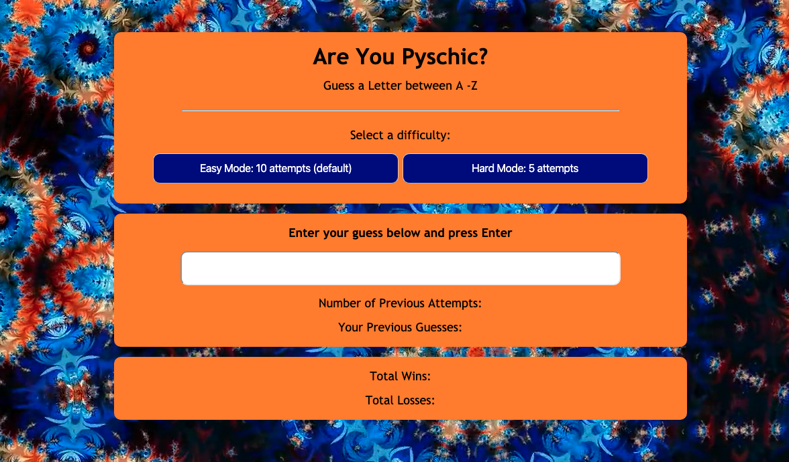

# psychic-game

### Overview:
A fun and interactive game for web browsers built using HTML5, CSS, and JavaScript.
The game will tally wins, losses, guesses left, guesses so far with both an easy (5 guesses) and hard (10 guesses) mode.

### Link to game: https://lindseytummond.github.io/psychic-game/

### How to Play:
Choose a letter from A - Z and test your psychic ability to see if you can read a computers mind!

