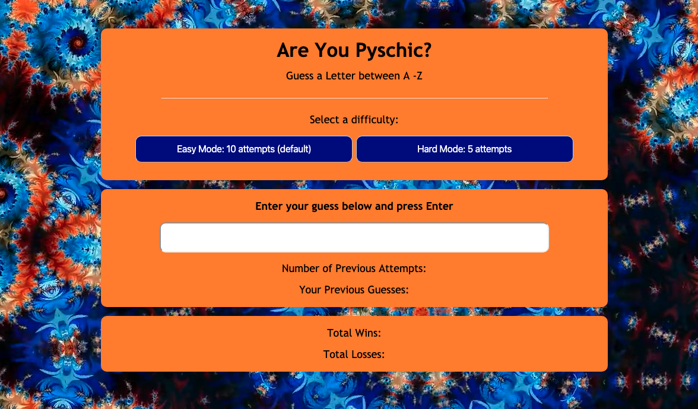

# Are You Psychic? Game

## Overview:
A fun and interactive game for web browsers built using HTML5, CSS, and JavaScript.
The game will tally wins, losses, guesses left, guesses so far with both an easy (5 guesses) and hard (10 guesses) mode.

## Author:
Lindsey Tummond
- <a href="https://lindseytummond.github.io/portfolio/" target="_blank"> Portfolio </a>
- <a href="https://github.com/lindseytummond" target="_blank"> GitHub </a>
- <a href="https://www.linkedin.com/in/lindsey-tummond-b86aa341/" target="_blank"> LinkedIn </a>

## Learning Points:
- exploration into Javascript, specifically ‘getElementById’
- utilization of ‘Math.floor’ and ‘Math.random’
- understanding of multiple files and how to link file structure

## Technologies:
-	  HTML
-   CSS
-   Javascript
-   GitHub

## How to Play:
Use the following link https://lindseytummond.github.io/psychic-game/ to open the application.  
Choose a letter from A - Z to test your psychic ability and see if you can read the psychic's mind!

## App Example:

